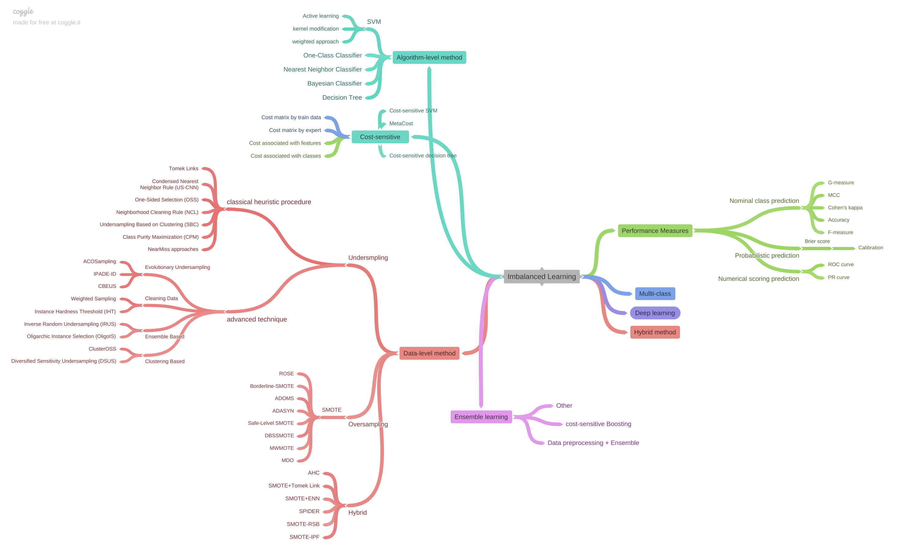

- research about Imbalanced Learning & Anomaly Detection, Outlier Analysis
  - tabular, time series, graph

<h3>:open_book: Index</h3>
<!-- TOC -->

- [Practice](#practice)
- [Project](#project)
- [Paper Read](#paper-read)
  - [Imbalanced Learning](#imbalanced-learning)
    - [Survey](#survey)
    - [Perfomance Measure](#perfomance-measure)
    - [Cost-sensitive](#cost-sensitive)
    - [Sampling](#sampling)
    - [Ensemble Learning](#ensemble-learning)
    - [Feature Selection](#feature-selection)
    - [Imbalanced Classification with Multiple Classes](#imbalanced-classification-with-multiple-classes)
  - [Anomaly Detection, Outlier Analysis](#anomaly-detection-outlier-analysis)
    - [Outlier Analysis (2017) - Charu C. Aggarwal](#outlier-analysis-2017---charu-c-aggarwal)
    - [Survey](#survey-1)
    - [Learning feature representations of normality](#learning-feature-representations-of-normality)
    - [Time Series and Streaming Anomaly Detection](#time-series-and-streaming-anomaly-detection)
- [Other References](#other-references)
  - [Article](#article)
  - [Open Source](#open-source)

<!-- /TOC -->

# Practice
- Dacon 신용카드 사용자 연체 예측 AI 경진대회 [`code`](./practice/Dacon%20%EC%8B%A0%EC%9A%A9%EC%B9%B4%EB%93%9C%20%EC%82%AC%EC%9A%A9%EC%9E%90%20%EC%97%B0%EC%B2%B4%20%EC%98%88%EC%B8%A1/)
  - task: tabular, multiple classes classification(3 classes), imbalance
  - method: OVO + Oversampling, Probability Calibration, MetaCost
- Kaggle Credit Card Fraud Detection [`code`](./practice/Kaggle%20Credit%20Card%20Fraud%20Detection/)
  - task: tabular, binary classification, imbalance
  - method: SMOTE, Unsupervised PCA based algorithm

# Project
- 네트워크임베딩 대학원수업 기말 프로젝트 (Anomaly Detection with Graph Embedding Ensemble) [`pdf`](/practice/Anomaly_Detection_with_Graph_Embedding_Ensemble.pdf)
  - task: tabular data, graph embedding, anomaly detection
  - method: Node2Vec, PCA, Mahalanobis, LOF, Random Forest
- 석사 졸업 논문 (Anomaly Detection with Adaptive-AutoEncoder Ensemble) [`repository`](https://github.com/minsoo9506/my-paper)
  - task: tabular data, ensemble, anomaly detection
  - method: AutoEncoder
- 모델 구현 (라이브러리화) [`repository`](https://github.com/minsoo9506/catchMinor)

# Paper Read

## Imbalanced Learning

  
Survey

### Survey

- Learning From Imbalanced Data: open challenges and future directions (survey article 2016) [`paper`](https://link.springer.com/article/10.1007/s13748-016-0094-0)

  
Perfomance Measure

### Perfomance Measure

- The precision-recall plot is more informative than the ROC plot when evaluating binary classifiers on imbalanced datasets [`paper`](https://pubmed.ncbi.nlm.nih.gov/25738806/)
- The Relationship Between Precision-Recall and ROC Curves [`paper`](https://www.biostat.wisc.edu/~page/rocpr.pdf)
- Predicting Good Probabilities With Supervised Learning [`paper`](https://www.cs.cornell.edu/~alexn/papers/calibration.icml05.crc.rev3.pdf)
- Properties and benefits of calibrated classifiers [`paper`](http://www.ifp.illinois.edu/~iracohen/publications/CalibrationECML2004.pdf)
- The precision-recall plot is more informative than the ROC plot when evaluating binary classifiers on imbalanced datasets [`paper`](https://www.researchgate.net/publication/273155496_The_Precision-Recall_Plot_Is_More_Informative_than_the_ROC_Plot_When_Evaluating_Binary_Classifiers_on_Imbalanced_Datasets)

  
Cost-sensitive

### Cost-sensitive

- An optimized cost-sensitive SVM for imbalanced data learning [`paper`](https://webdocs.cs.ualberta.ca/~zaiane/postscript/pakdd13-1.pdf)
- Metacost : a general method for making classifiers cost-sensitive (KDD 99) [`paper`](https://homes.cs.washington.edu/~pedrod/papers/kdd99.pdf)
- The influence of class imbalance on cost-sensitive learning (IEEE 2006) [`paper`](https://ieeexplore.ieee.org/document/4053137)
- Learning and Making Decisions When Costs and Probabilities are Both Unknown (2001) [`paper`](https://cseweb.ucsd.edu/~elkan/kddbianca.pdf)

  
Sampling

### Sampling

- SMOTE (2002) [`paper`](https://arxiv.org/pdf/1106.1813.pdf)
- SMOTE for learning from imbalanced data : progress and challenges (2018) [`paper`](https://www.jair.org/index.php/jair/article/view/11192)
- Influence of minority class instance types on SMOTE imbalanced data oversampling [`paper`](https://www.researchgate.net/publication/320625181_Influence_of_minority_class_instance_types_on_SMOTE_imbalanced_data_oversampling)
- Calibrating Probability with Undersampling for Unbalanced Classification (2015) [`paper`](https://www3.nd.edu/~dial/publications/dalpozzolo2015calibrating.pdf)
- A Study of the Behavior of Several Methods for Balancing Machine Learning Training Data [`paper`](https://www.researchgate.net/publication/220520041_A_Study_of_the_Behavior_of_Several_Methods_for_Balancing_machine_Learning_Training_Data)
- Dynamic Sampling in Convolutional Neural Networks for Imbalanced Data Classification [`paper`](https://users.cs.fiu.edu/~chens/PDF/MIPR18_CNN.pdf) [`review`]()

  
Ensemble Learning

### Ensemble Learning

- Self-paced Ensemble for Highly Imbalanced Massive Data Classification (2020) [`paper`](https://arxiv.org/abs/1909.03500)

  
Feature Selection

### Feature Selection

- Ensemble-based wrapper methods for feature selection and class imbalance learning (2010) [`paper`](http://citeseerx.ist.psu.edu/viewdoc/download?doi=10.1.1.706.4216&rep=rep1&type=pdf)
- A comparative study of iterative and non-iterative feature selection techniques for software defect prediction

  
Imbalanced Classification with Multiple Classes

### Imbalanced Classification with Multiple Classes

- Imbalanced Classification with Multiple Classes
  - Decomposition-Based Approaches
  - Ad-hoc Approaches

## Anomaly Detection, Outlier Analysis

  
Outlier Analysis (2017) - Charu C. Aggarwal

### Outlier Analysis (2017) - Charu C. Aggarwal

  
Suvey

### Survey

- Deep Learning for Anomaly Detection A Review (2020) [`paper`](https://arxiv.org/pdf/2007.02500.pdf) [`review`](./review/Deep%20Learning%20for%20Anomaly%20Detection%20A%20Review.md)
- Autoencoders (2020) [`paper`](https://arxiv.org/pdf/2003.05991.pdf)

  
Learning feature representation of normality

### Learning feature representations of normality

- Outlier Detection with AutoEncoder Ensemble (2017) [`paper`](https://saketsathe.net/downloads/autoencoder.pdf)
- Auto-Encoding Variational Bayes (2014) [`paper`](https://arxiv.org/abs/1312.6114) [`review`](https://minsoo9506.github.io/07-vae/) [`code`](./src/models/BaseVAE.py)
- Deep Variational Information Bottleneck (ICLR 2017) [`paper`](https://arxiv.org/abs/1612.00410) [`review`](https://minsoo9506.github.io/06-ib/)
- Extracting and Composing Robust Features with Denoising Autoencoders (2008) [`paper`](https://www.cs.toronto.edu/~larocheh/publications/icml-2008-denoising-autoencoders.pdf)
- Generatice Adversarial Nets (NIPS 2014) [`paper`](https://papers.nips.cc/paper/2014/hash/5ca3e9b122f61f8f06494c97b1afccf3-Abstract.html) [`review`](https://minsoo9506.github.io/03-gan/) [`code`](./src/models/BaseGAN.py)
- Least Squares Generative Adversarial Networks (2016) [`paper`](https://arxiv.org/abs/1611.04076) [`review`](https://minsoo9506.github.io/04-lsgan/)
- Adversarial Autoencoders (2016) [`paper`](https://arxiv.org/abs/1511.05644) [`review`](./review/Adversarial_Autoencoders.pdf)
- Generative Probabilistic Novelty Detection with Adversarial Autoencoders (NIPS 2018) [`paper`](https://papers.nips.cc/paper/2018/file/5421e013565f7f1afa0cfe8ad87a99ab-Paper.pdf)
- Deep Autoencoding Gaussian Mixture Model For Unsupervised Anomaly Detection (ICLR 2018) [`paper`](https://sites.cs.ucsb.edu/~bzong/doc/iclr18-dagmm.pdf) [`review`](./review/DAGMM.pdf)
- Anomaly Detection with Robust Deep Autoencoders (KDD 2017) [`paper`](https://www.eecs.yorku.ca/course_archive/2017-18/F/6412/reading/kdd17p665.pdf)

  
Time Series and Streaming Anomaly Detection

### Time Series and Streaming Anomaly Detection

- Anomaly Detection In Univariate Time-Series : A Survey on the state-of-the-art [`paper`](https://arxiv.org/abs/2004.00433)
- USAD : UnSupervised Anomaly Detection on multivariate time series (KDD2020) [`paper`](https://dl.acm.org/doi/10.1145/3394486.3403392) [`review`](./review/USAD.pdf)
- Variational Attention for Sequence-to-Sequence Models (2017) [`paper`](https://arxiv.org/abs/1712.08207)
- A Multimodal Anomaly Detector for Robot-Assisted Feeding Using an LSTM-based Variational Autoencoder (2017) [`paper`](https://arxiv.org/abs/1711.00614)
- Outlier Detection for Time Series with Recurrent Autoencoder Ensembles (2019) [`paper`](https://www.ijcai.org/proceedings/2019/0378.pdf)
- Robust Anomaly Detection for Multivariate time series through Stochastic Recurrent Neural Network (KKD 2019) [`paper`](https://github.com/NetManAIOps/OmniAnomaly)
- Time Series Anomaly Detection with Multiresolution Ensemble Decoding (AAAI 2021) [`paper`](https://ojs.aaai.org/index.php/AAAI/article/view/17152)
- An Improved Arima-Based Traffic Anomaly Detection Algorithm for Wireless Sensor Networks (2016) [`paper`](https://journals.sagepub.com/doi/pdf/10.1155/2016/9653230)
- Time-Series Anomaly Detection Service at Microsoft (2019) [`paper`](https://arxiv.org/abs/1906.03821)
- Time Series Anomaly Detection Using Convolutional Neural Networks and Transfer Learning (2019) [`paper`](https://arxiv.org/pdf/1905.13628.pdf) [`code`](src/models/CNNBasedTS.py)
- Abuse and Fraud Detection in Streaming Services Using Heuristic-Aware Machine Learning (arxiv, 2022, Netflix) [`paper`](https://arxiv.org/pdf/2203.02124.pdf)
- Are Transformers Effective for Time Series Forecasting?, 2022 [`paper`](https://arxiv.org/pdf/2205.13504.pdf)

# Other References

## Article

- [Machine Learning for Fraud Detection in Streaming Services (Netflix blog medium article)](https://netflixtechblog.medium.com/machine-learning-for-fraud-detection-in-streaming-services-b0b4ef3be3f6)
- [Fraud Detection on Blockchain based on Machine learning (medium article)](https://jysden.medium.com/fraud-detection-on-ethereum-with-graph-neural-network-f434e5b9aef5)
- [Unsupervised and semi-supervised anomaly detection with data-centric ML, google blog](https://ai.googleblog.com/2023/02/unsupervised-and-semi-supervised.html)
- [Warden: Real Time Anomaly Detection at Pinterest](https://medium.com/pinterest-engineering/warden-real-time-anomaly-detection-at-pinterest-210c122f6afa)
- [배민 앱 리뷰 품질을 향상시킨 방법은? 머신 러닝 X 네트워크 탐지 모델 도입](https://techblog.woowahan.com/11829/)
- [Fighting Spam using Clustering and Automated Rule Creation](https://medium.com/pinterest-engineering/fighting-spam-using-clustering-and-automated-rule-creation-1c01d8c11a05)

## Open Source
